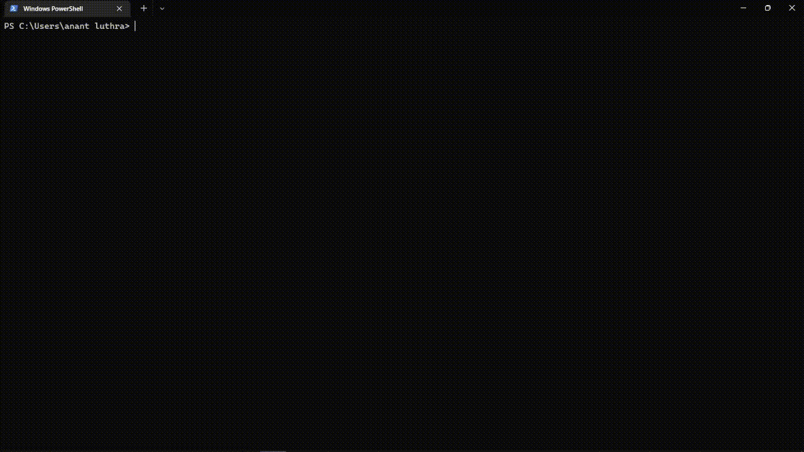
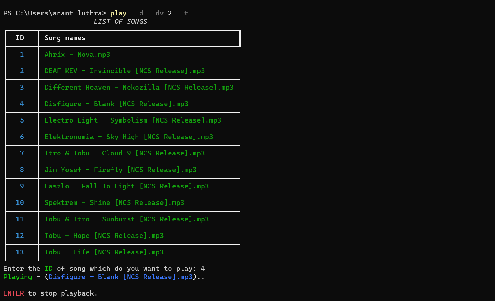
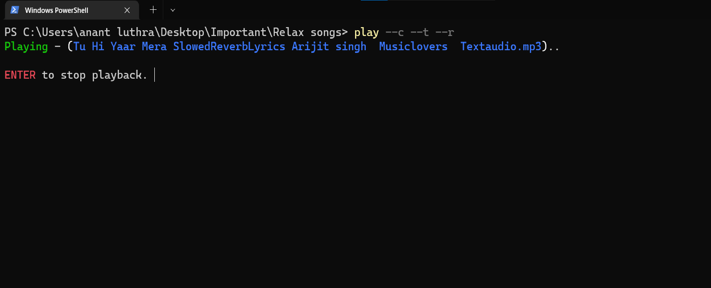
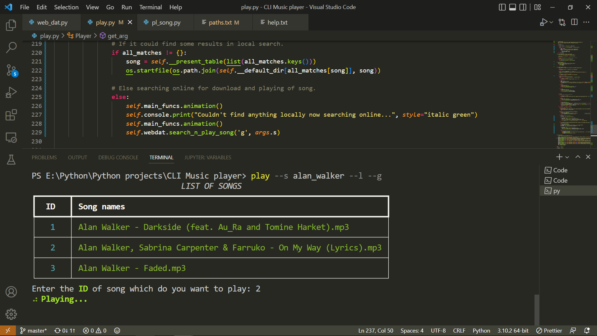
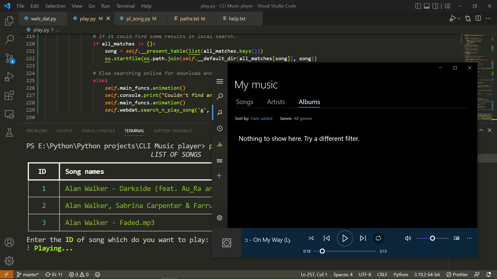

# CLI Music Player

## Full Demonstration video of this project [🔗](https://www.youtube.com/watch?v=SfnvxynG68s)

## Features
- It is used for quickly playing music through terminal command
- You can play music from current directory.
- You can play music from all folders which path is stored in [paths.txt](./assets/paths.txt)
- Also you can play music by searching.
- You can search song across all the folders given in [paths.txt](./assets/paths.txt)
- You can also download and play song which is not even before present in your computer.
- I highly recommend you to set an alias of this in your windows 


## Requirements 
- Python 3.10 or higher

## Clone this repository

```
git clone https://github.com/AnantLuthra/cli-music-player.git
```

### Module used
- rich = 11.1.0
- playsound = 1.2.2
- youtube_dl = 2021.12.17
- requests = 2.27.1
- thefuzz = 0.19.0
- python_Levenshtein = 0.12.2 (wheel file)
- os
- random
- argparse
- time
- multiprocessing
- urllib.request

---

### Setup

1. Make sure to put all your songs folders path in [paths.txt](./assets/paths.txt), like sample given paths are stored before.
2. And must install `python_Levenshtein` from the provided wheel file in assets folder.

```$ pip install assets\python_Levenshtein-0.12.2-cp310-cp310-win_amd64.whl```
> This is for python 3.10 64 bit version. If you want to download wheel file for you own specifiec python version then download from this site - [link](https://www.lfd.uci.edu/~gohlke/pythonlibs/#python-levenshtein)

3. Make sure to change the path written on line number `44` and `120` in [play.py](play.py) to the path where you have cloned this repository.

## Commands

|Argument |      Description                                     |
| ------- |--------------------------------------------------    |
| `--help`| ->  For help                                         | 
| `--h`   | ->  For help                                         |  
| `--d`   | ->  To play music from default directory             |
| `--dv`  | ->  Value of default directory                       | 
| `--s`   | ->  For playing specific song                        | 
| `--r`   | ->  For playing random song from chosen directory    | 
| `--t`   | ->  For playing music in terminal                    | 
| `--g`   | ->  For playing music through windows music player   | 
| `--c`   | ->  For playing songs from the current directory     |
| `--l`   | ->  For searching songs in local system              |
| `--w`   | ->  For search & play song from web                  |

---
### Usage

- `--d --g` = Just for playing song from default directory with using windows media player
- `--d --t` = For playing from default directory in terminal.
- `--d --t --r` = For playing random song from default directory in terminal
- `--c --g --r` = For playing random song from current directory using windows media player


---
#### Using --s argument

- `play --s faded_alan_walker --g` = For downloading and playing song from youtube. Remember to search it by passing --s argument and value having `_` instead of space.
- And use `--g` argument for playing song while using `--s` argument instead of `--t` as it often time gives this error - _A problem occurred in initializing MCI_



---

#### Some other previews



---

- Using `--c --t --r` arguments.



---

- Using `--s alan_walker --l --g` argument.
  


